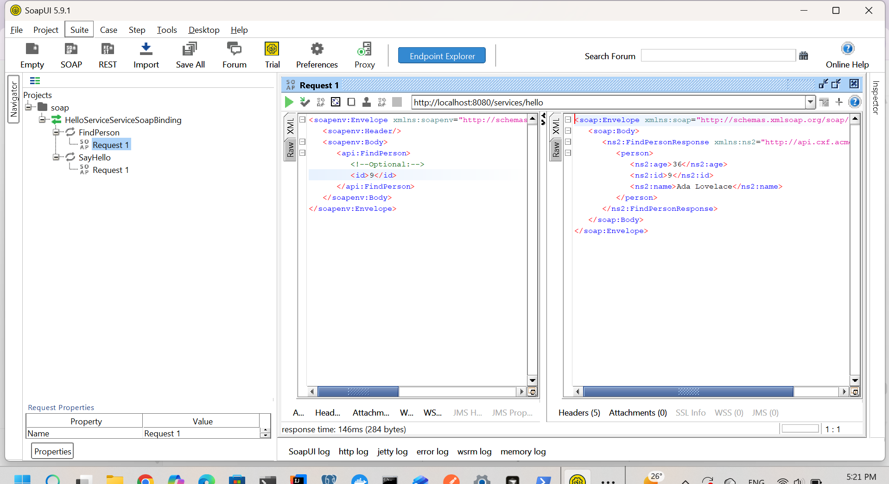
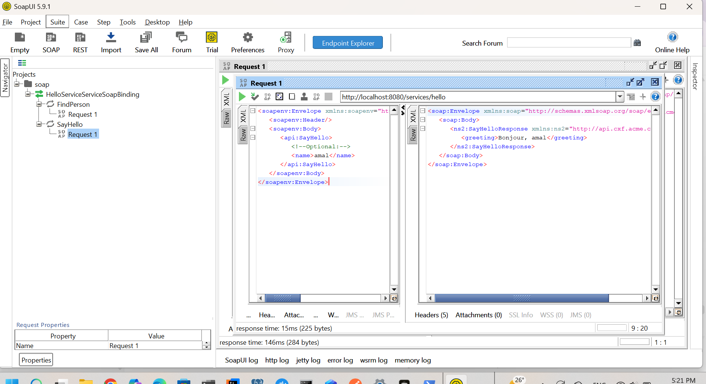

## SOAP Web Service – Spring Boot + Apache CXF

Ce projet implémente un Web Service SOAP basé sur Spring Boot, Apache CXF et JAX-WS.
Le serveur expose deux opérations SOAP testables via SoapUI.

````` Technologies utilisées `````

Spring Boot

Apache CXF (publication du service SOAP)

JAX-WS (@WebService, @WebMethod)

JAXB (@XmlRootElement) pour la sérialisation XML

SoapUI (tests des endpoints SOAP)

`` Opérations SOAP disponibles ``
 1) FindPerson(id)

Retrouve une personne via son identifiant.

 2) SayHello(name)

Retourne un message personnalisé.


## 🧪 Test SOAP – FindPerson


## 🧪 Test SOAP – SayHello



## Ce projet montre clairement :

Comment créer un service SOAP moderne avec Spring Boot

Comment structurer une API SOAP (WSDL, opérations…)

Comment tester facilement via SoapUI

Comment utiliser CXF pour publier un endpoint SOAP
